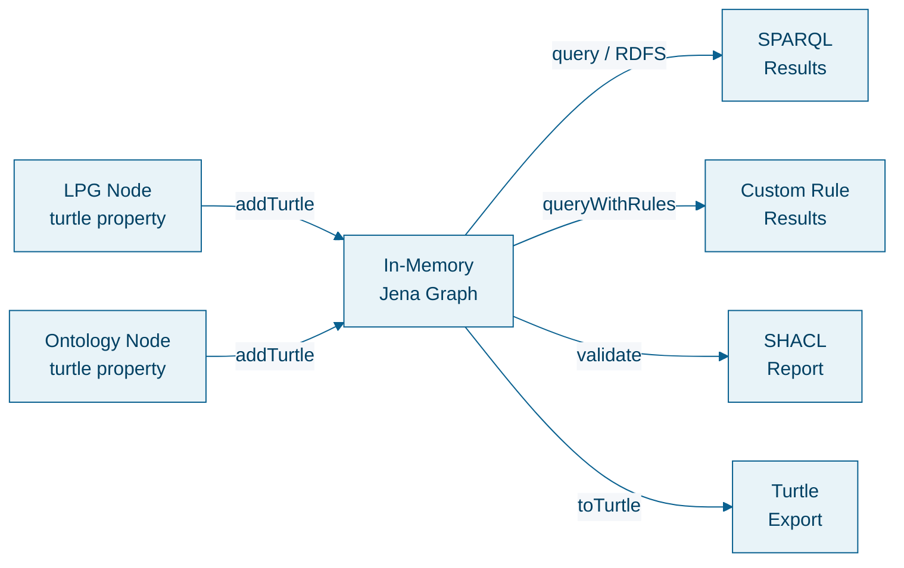
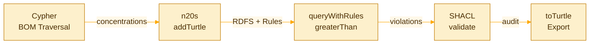

<!-- _class: lead -->


# n20s: In-Memory RDF Reasoning from Cypher
### Scope first, reason second

Pierre Halftermeyer · Neo4j

---

## The Problem

You have a **property graph** with rich structure — BOMs, supply chains, patient records.

You also have **domain knowledge** — ontologies, regulation limits, classification hierarchies.

<div style="display:flex; gap:2rem; margin-top:1rem;">
<div>

### Cypher excels at
- Multi-hop traversal
- Path aggregation
- Pattern matching at scale

</div>
<div>

### But can't do
- Class hierarchy inference
- Rule-based entailment
- SHACL validation

</div>
</div>

---


<!-- _class: dense -->
## What if you could do both?

```cypher
// Cypher scopes — walk the graph, project triples
MATCH (p:Product)-[:CONTAINS*]->(i:Ingredient)-[:HAS_TRIPLE]->(t:Triple)
WITH n20s.graph.project('check', t.s, t.p, t.o) AS g
RETURN g.tripleCount;

// n20s reasons over the scoped set
CALL n20s.graph.queryWithRules('check', $sparql, $rules, 'RDFS')
YIELD row RETURN row;
```

**Cypher** traverses the graph and scopes the RDF triple set.
**n20s** reasons over it — RDFS inference, custom rules, SHACL.

Think **GDS projections**, but for RDF reasoning instead of graph algorithms.

---

<!-- _class: lead -->

# What is n20s?

---


<!-- _class: dense -->
## n20s — A Custom Neo4j Plugin

An **open-source Neo4j plugin** that brings RDF reasoning into Cypher workflows.

- Built on **Apache Jena** — production-grade RDF engine
- **Ephemeral in-memory graphs** — no persistent triple store
- **Not a SPARQL endpoint** — a reasoning engine embedded in Cypher
- Works alongside **GDS**, **APOC**, and standard Cypher

> **Key principle:** RDF triples travel as "cargo" on LPG nodes — your graph model stays clean.

*github.com/halftermeyer/neo4j-n20s*

---


<!-- _class: dense -->
## How It Works



1. **Scope** — Cypher selects which nodes carry relevant RDF
2. **Project** — `addTurtle` loads their cargo into a named in-memory graph
3. **Reason** — RDFS, custom rules, SHACL — all in-memory
4. **Drop** — graph is freed, no trace left

---


<!-- _class: dense -->
## RDF Cargo on LPG Nodes

Each node carries its RDF knowledge as a `turtle` property:

```cypher
(:Ingredient {name: 'Retinol', inci: 'RETINOL',
  turtle: '
    @prefix cosmo: <http://example.org/cosmo#> .
    cosmo:Retinol a cosmo:RetinoidAgent,
                    cosmo:PhotosensitiveAgent ;
        cosmo:maxConcentrationEU "0.05"^^xsd:double .
  '})
```

- **LPG** stores structure — BOMs, suppliers, markets
- **RDF** stores classification — ontology types, regulation limits
- They coexist on the same node without polluting each other

---

<!-- _class: lead periwinkle -->

# Core API

---

<!-- _class: dense -->

## The 8 Key Operations

| Procedure | What it does | Reasoning |
|---|---|---|
| `addTurtle(name, turtle)` | Parse Turtle string into named graph | — |
| `query(name, sparql, profile)` | SPARQL SELECT with backward chaining | RDFS, OWL |
| `queryWithRules(name, sparql, rules, profile)` | SPARQL + custom Jena rules | RDFS + rules |
| `infer(name, profile)` | Forward-chain — materialize all entailments | RDFS, OWL |
| `inferWithRules(name, rules, profile)` | Forward-chain with custom rules | RDFS + rules |
| `validate(name)` | Run SHACL shapes against the graph | SHACL |
| `toTurtle(name)` | Export graph as Turtle string | — |
| `drop(name)` | Free memory | — |

**Plus:** `n20s.graph.project(name, s, p, o)` — aggregating function to build triples from Cypher results

---


<!-- _class: dense -->
## Reasoning Profiles

<div style="display:flex; gap:2rem;">
<div>

### Backward Chaining
*"Reason on the fly"*

```cypher
CALL n20s.graph.query('g',
  'SELECT ?x WHERE {
     ?x rdf:type cosmo:Allergen
   }',
  'RDFS')
```

Infers `Retinol` is an `Allergen` if `RetinoidAgent rdfs:subClassOf Allergen` — without materializing.

</div>
<div>

### Forward Chaining
*"Materialize everything"*

```cypher
CALL n20s.graph.infer('g', 'RDFS')
YIELD triplesBefore, triplesAfter
// 265 → 773 triples
```

All inferred triples added to the graph. Then export with `toTurtle` for audit.

</div>
</div>

---


<!-- _class: dense -->
## Custom Rules with Builtins

Jena rules layered **on top of** RDFS:

```cypher
CALL n20s.graph.queryWithRules('g', $sparql, '
[eu_limit:
  (?ing cosmo:actualConcentration ?actual)
  (?ing cosmo:maxConcentrationEU ?limit)
  greaterThan(?actual, ?limit)
  (?ing rdfs:label ?name)
  ->
  (?ing cosmo:violatesEU ?name)]
', 'RDFS')
```

- RDFS runs first → resolves class hierarchy
- Custom rules fire second → use `greaterThan`, `regex`, `sum`
- SPARQL queries the enriched model

---

<!-- _class: lead marigold -->

# The Use Case
### Cosmetics R&D — Formulation Screening

---


<!-- _class: dense -->
## The Domain

A cosmetic product is a **multi-level bill of materials**:

```
Product (100%)
├── Water Phase (65%)
│   ├── Water (90%)
│   ├── Hyaluronic Acid (4%)
│   └── Preservative (0.8%)
├── Oil Phase (25%)
│   ├── Squalane (80%)
│   └── Active Oil Blend (20%)
│       ├── Retinol (3%)     ← regulated
│       └── Carrier Oil (97%)
└── Active Phase (10%)
    ├── Antioxidant (40%)
    └── Peptide (60%)
```

**Final Retinol concentration** = 25% × 20% × 3% = **0.15%**
Cypher computes this via `reduce` over the BOM path.

---


<!-- _class: dense -->
## The Challenge

153 ingredients · 36 products · 4 markets (EU, US, China, Japan)

<div style="display:flex; gap:2rem;">
<div>

### Questions Cypher alone can't answer
- *"Is Retinol a PhotosensitiveAgent?"*
  (inferred via RDF class hierarchy)
- *"Does this product comply with EU regulation?"*
  (requires `greaterThan` on typed values)
- *"Does this allergen have required labeling?"*
  (SHACL constraint validation)

</div>
<div>

### Questions RDF alone can't answer
- *"What is Retinol's final concentration?"*
  (multi-level BOM traversal × ratio multiplication)
- *"Which supplier's disruption affects the most products?"*
  (graph path aggregation)

</div>
</div>

---

## The Pipeline: Scope → Reason → Validate



1. **Cypher** walks the BOM tree, computes actual concentrations
2. **n20s** loads ingredient RDF + ontology + concentrations
3. **Jena rules** fire `greaterThan` per market (EU, US, China, Japan)
4. **SHACL** validates labeling requirements
5. **toTurtle** exports the inferred graph for regulatory audit

---

<!-- _class: lead hibiscus -->

# Four Scenarios
### Graph traversal scopes RDF reasoning

---

## 1. Regulatory Change Impact

*"EU just lowered the Retinoid limit. Which products break?"*

**Cypher** traverses `Market ← Product → BOM* → Ingredient`, multiplies ratios.
**RDFS** infers which ingredients are `RetinoidAgent` (catching subclasses).
**Rules** fire `greaterThan` with the new limit.

> **The slider moment:** drag the limit from 5% to 0.1% and watch products cascade from green to red.

---

## 2. Photosensitive Agents in Non-SPF Products

**RDFS** infers `PhotosensitiveAgent` class membership — not a label, an inferred type.
**Cypher** finds all non-Sunscreen products via BOM traversal.
**Result:** products that need an SPF pairing recommendation.

## 3. Supplier Disruption Cascade

**Cypher** traverses `Supplier ← Ingredient → BOM ← Product` for blast radius.
**n20s** validates each substitute against multi-market rules.
**Result:** which swaps are compliant, at what cost delta.

---

## 4. Allergen Reclassification

Inject **one triple**: `cosmo:Niacinamide a cosmo:Allergen`

**Cypher** finds all products containing Niacinamide via BOM.
**SHACL** fires: *"Allergens must declare maxConcentrationEU."*
**Result:** products that now need new labeling.

> **Key insight:** Cypher determines WHAT gets reasoned about. n20s determines HOW it gets reasoned about. Neither is complete without the other.

---

<!-- _class: lead -->


# Let's See It Live

### *demo time*

---
